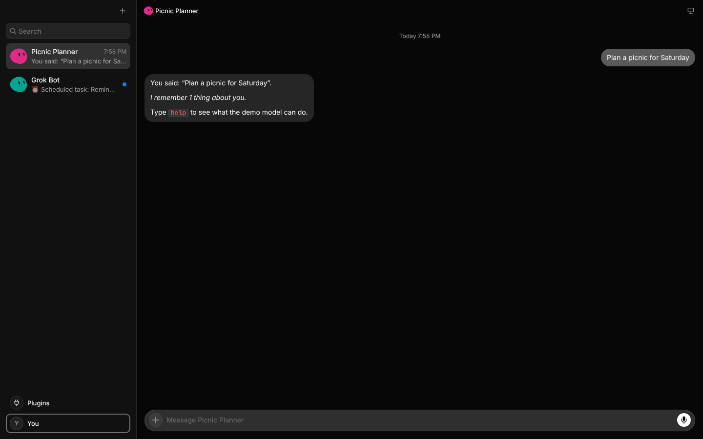

# GrokBot Cloud

Grok Bot on Cloudflare. The UI is the same as `main`'s app; the bots behind it
run on [pi-durable](https://github.com/earendil-works/pi/tree/main/packages/durable)
inside Durable Objects.




Nothing in `frontend/` or `source/` is changed or forked:

- **UI.** By default this is what the macOS package shows: the checksum-pinned
  Grok Bot 0.18.0 renderer with `main`'s own Router patch
  (`scripts/lib/router-renderer-patch.mjs`). The fallback is `main`'s readable
  reconstruction in `frontend/`, built here unchanged.
- **Contracts.** The coordinator frames, transcript entry shapes, roster and
  ordering replicas, the empty-sharing state, and the Routines schedule
  parser and descriptions all come from `source/shared`.
- **Bots.** Each user's bots live in one `GrokBot` Durable Object, and every
  bot in the sidebar is a pi-durable conversation. pi owns the transcript,
  the inbox of follow-ups and steers, model turns, tool calls, retries and
  crash recovery. The SDK's `PiHarness` wakes the object after eviction.

## How it fits together

```
browser ──────────────────────────────────────────────── Cloudflare Worker
 Grok Bot renderer (shipped 0.18.0 + Router patch,         │ static assets: the renderer + web bridge
   or frontend/ reconstruction), unchanged                 │ /api/*  config, auth, router, secrets, REST
 web bridge (src/web)                                      │ /agents/grok-bot/<bot>  coordinator WebSocket
   window.desktop          ← the Electron preload API      ▼
   window.coordinatorPort  ← WebSocket, same frames as    GrokBot Durable Object (one per user/bot space)
                             the desktop MessagePort         ├─ CoordinatorSockets: hello/ready, request/reply, events
                                                             ├─ PiHarness → pi-durable Harness (pi_* tables)
                                                             │    extension "grokbot": persona + memory sections,
                                                             │    memory_*, files_*, web_fetch, current_time, schedule_*
                                                             ├─ Automations: Routines on Lifecycle jobs (alarm)
                                                             ├─ Store: agents, memory, files, routines, secrets, usage
                                                             └─ model router: Workers AI / AI Gateway / OpenRouter /
                                                                Anthropic / OpenAI / offline demo
```

| Renderer expects (desktop host) | Implemented with |
| --- | --- |
| `listAgents`, `createAgent` → `{ agent }`, `updateAgent`, `deleteAgents`, `duplicateAgent`, unread / hidden | `gb_agents` rows; each one is a pi conversation |
| `openAgentTail` / `getAgentTranscriptTail` pages and `transcript` events (`appended`, `updated`, `snapshot`) | pi's agent events → `user message` / `send-message` / `tool-call` / `notice` entries, with the host's positional ids |
| ordered replicas (`ordered: { replicaKey, epoch, sequence }`, `snapshotEpoch`) | one epoch per isolate and one sequence per replica, as `HostReplicaWriter` does it; renderers resync on a gap |
| `sendPrompt` with `clientNonce` | pi `submit()` with `operationId = nonce:<clientNonce>`, echoed on the user entry |
| Routines (`getAgentAutomations`, `createAgentAutomation`, run now, enable) | Lifecycle jobs with idempotent runs, using `source/shared/automation-schedule.ts` |
| Settings → Router (`getInferenceRouter`, `secrets.upsert`) | per-bot Router choice and stored provider keys; usage is counted per provider |
| pinned bots and sidebar sections (`getPinnedAgents`, `getSidebarSections`) | stored in the bot, like the host's, so they follow you across browsers |
| unread, which the host derives from the focused window's active chat | the bridge reports each tab's selection (the renderer's persisted `selection.last-agent`, including chats shown from cache), numbered and retried, and again on every reconnect; the bot keeps it in SQLite with when each tab was last connected, and honours it while the tab is connected or for 15 s after (so across a restart, but not for tabs long gone) |
| a new coordinator port after a restart, and `promptAcceptanceStatus` | the bridge reconnects and pushes a fresh port, as Electron's main process does; the bot answers from its send ledger, so the renderer resends a prompt that never arrived |
| computer, rooms, channels, skills, teach | the host's "feature off" answers |

Settings → Router maps onto this deployment's providers:

| Choice | Model |
| --- | --- |
| **Cursor** | `DEFAULT_MODEL` (default: Workers AI `@cf/moonshotai/kimi-k2.7-code`) |
| **Claude Code** | Claude Sonnet 5.5: direct with an Anthropic key, otherwise through AI Gateway |
| **Codex** | GPT-5.5: direct with an OpenAI key, otherwise through AI Gateway |
| **OpenRouter** | `x-ai/grok-4.3`, using the key pasted in the panel |

## The two UIs, and a licensing caveat

`vite build` picks the UI.

- **`shipped`** is the default whenever a verified DMG is available. It is
  hydrated by `scripts/hydrate-renderer.mjs`: it verifies the Git LFS copy of
  `Grok_Bot_0.18.0.dmg` against `main`'s pinned SHA-256, extracts
  `dist/renderer` with 7-Zip and `@electron/asar`, and applies `main`'s Router
  patch. The result is cached in `cloud/.renderer/`, which is gitignored.
- **`reconstructed`** (`GROKBOT_UI=reconstructed`) uses `frontend/`. This is
  the automatic fallback when no DMG is available. Known limitation: its
  composer stops accepting input after you switch chats. That is in the
  reconstruction's draft store, not the bot.

**The shipped renderer is Anysphere's proprietary code.** `main` treats it as
a pinned build input and never commits it, and this project does the same.
A deployment still serves it to anyone who can reach the Worker, so:

- set `GROKBOT_TOKEN`, put the Worker behind Cloudflare Access, or both;
- or build with `GROKBOT_UI=reconstructed` for anything public.

## Run locally

```sh
cd cloud
pnpm install
git lfs pull --include="research-archives/original/0.18.0/macos-arm64/*"   # once, for the shipped UI (needs 7z)
pnpm build
node e2e/run.mjs          # builds, runs wrangler dev on the offline demo model, drives Chromium
pnpm dev                  # Vite + workerd; the AI binding is remote, so this needs `wrangler login`
```

The **demo model** (`DEFAULT_MODEL=demo/grokbot-demo`) runs fully offline and
calls the real tools. Type `help` in a chat to see its commands. The e2e
suite and the tests use it.

## Deploy

[`.github/workflows/deploy-grokbot.yml`](../.github/workflows/deploy-grokbot.yml)
verifies, then deploys on every push to `main` that touches `cloud/`,
`frontend/` or `source/shared/`. You can also run it by hand. Set these in
**Settings → Environments → `cloudflare-production`**:

| Kind | Name | |
| --- | --- | --- |
| Secret | `CLOUDFLARE_API_TOKEN`, `CLOUDFLARE_ACCOUNT_ID` | Required. Create the token from the **Edit Cloudflare Workers** template. |
| Secret | `GROKBOT_TOKEN` | Strongly recommended. Every API call and socket must present it; the UI asks for it once. |
| Secret | `OPENROUTER_API_KEY`, `ANTHROPIC_API_KEY`, `OPENAI_API_KEY` | Optional. Users can also paste keys in Settings → Router. |
| Variable | `GROKBOT_DEFAULT_MODEL`, `GROKBOT_URL`, `GROKBOT_UI` | Optional. |

To deploy by hand: `npx wrangler login && pnpm run deploy && npx wrangler secret put GROKBOT_TOKEN`.

## Tests

```sh
pnpm typecheck   # web bridge (DOM) and Worker (workers-types), including the reused frontend/ and source/ files
pnpm test        # 20 workerd tests: the coordinator protocol over a real WebSocket, checked with the renderer's own projections
node e2e/run.mjs # 10 browser steps against wrangler dev (GROKBOT_UI=reconstructed: 9)
```

The e2e suite covers:

- onboarding and chat;
- memory carried across turns and bots;
- reloading mid-answer;
- a reminder fired by the Durable Object alarm;
- creating a bot from the To: picker;
- Settings → Router, including saving a key;
- `SIGKILL` of the server mid-answer, after which the answer resumes, with
  the interrupted partial answer replaced by the retry;
- another `SIGKILL`, after which the UI reconnects on its own and a message
  typed straight away is delivered.

## Files

| Path | What |
| --- | --- |
| `src/web/desktop-bridge.ts` | `window.desktop` for the browser (the Electron preload contract in `frontend/src/recovered/contracts/desktop-bridge.ts`) |
| `src/web/session.ts` | the bot session, token, and WebSocket coordinator port |
| `src/server/bot.ts` | `GrokBot` Durable Object: coordinator methods, transcript projection and events, routing |
| `src/server/sockets.ts` | coordinator WebSocket capability (frames from `source/shared/rpc/coordinator-port.ts`) |
| `src/server/transcript.ts` | pi's view → Grok Bot transcript entries |
| `src/server/automations.ts` | Routines on Lifecycle jobs |
| `src/server/models.ts`, `demo-model.ts` | model router and the offline demo model |
| `src/server/tools/*` | memory, files, web fetch, time, scheduling |
| `scripts/hydrate-renderer.mjs` | shipped-renderer hydration plus `main`'s Router patch |
